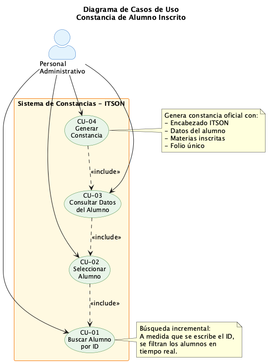
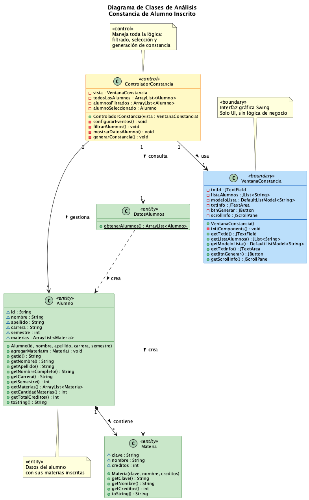
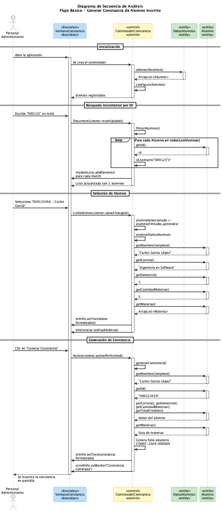
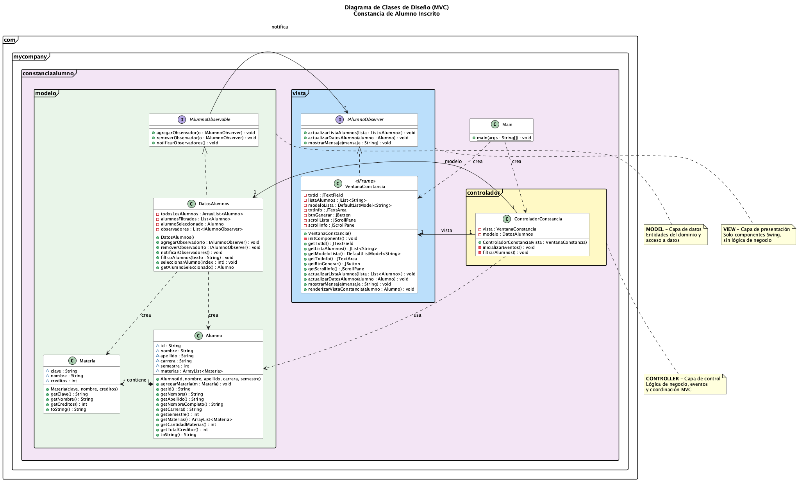
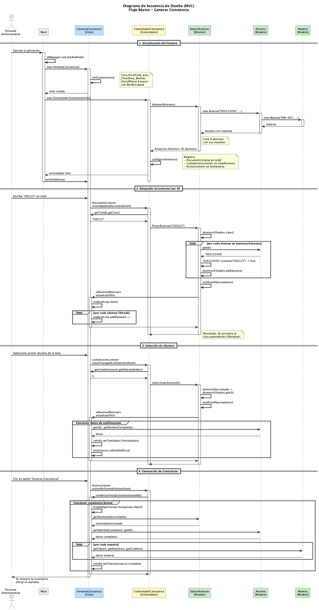

# Constancia de Alumno Inscrito 🎓

Proyecto Java Swing (MVC) para generar constancias de alumnos inscritos.  
**Materia:** Arquitectura de Software — ITSON

## 📋 Descripción

Sistema que permite buscar un alumno por su ID de forma incremental, ver sus datos de inscripción (semestre, materias, créditos) y generar una constancia oficial.

## 🏗️ Arquitectura MVC

```
src/main/java/com/mycompany/constanciaalumno/
├── Main.java                              # Entry point
├── modelo/                                # MODEL
│   ├── Alumno.java                        # Entidad alumno
│   ├── Materia.java                       # Entidad materia
│   └── DatosAlumnos.java                  # Datos de prueba
├── vista/                                 # VIEW
│   └── VentanaConstancia.java             # JFrame (solo UI)
└── controlador/                           # CONTROLLER
    └── ControladorConstancia.java         # Lógica de negocio
```

## 🚀 Cómo Ejecutar

```bash
mvn compile exec:java -Dexec.mainClass="com.mycompany.constanciaalumno.Main" -q
```

## 📐 Diagramas UML

### Diagrama de Casos de Uso


### Diagrama de Clases de Análisis


### Diagrama de Secuencia de Análisis (Flujo Básico)


### Diagrama de Clases de Diseño (MVC)


### Diagrama de Secuencia de Diseño (MVC)


## 🎬 Flujo de la Aplicación

1. **Buscar:** Escribe un ID parcial → se filtran alumnos en tiempo real
2. **Seleccionar:** Clic en un alumno → aparecen sus datos de confirmación
3. **Generar:** Clic en "Generar Constancia" → constancia oficial con folio

## 🛠️ Requisitos

- Java 17+
- Maven 3.x
- NetBeans (opcional, para abrir como proyecto)

## 👤 Autor

Alejandro Montijo — ITSON
